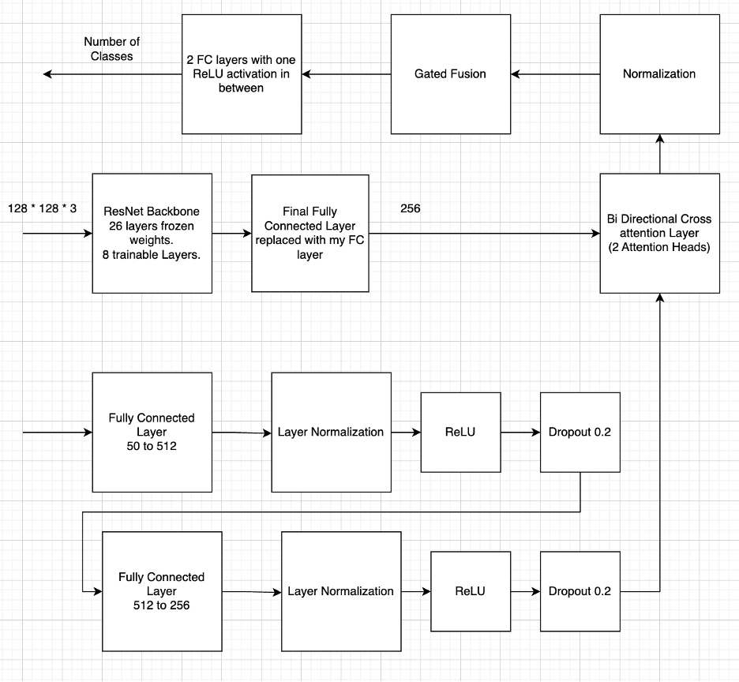

# Multi-Modal Visual Question Answering (VQA) – VizWiz Dataset

**Author:** Darshan Vijayaraghavan  
**Course:** Neural Networks and Deep Learning  
Visual Question Answering Challenge

---

## Overview

This project presents two custom multi-modal deep learning models developed to address the challenges in the **VizWiz VQA dataset**:

1. **Binary Classification**: Predict whether a visual question is answerable.
2. **Answer Prediction**: Predict the most likely answer to a visual question based on top-N frequent classes.

Both models integrate visual and textual modalities and were developed from scratch, incorporating advanced attention and fusion mechanisms to outperform baseline approaches.

---

## Model Architecture

Below is a high-level diagram of the architecture, showcasing the multi-modal fusion of image and text features using cross-attention and gated fusion:

> 

---

## Dataset & Preprocessing

The **VizWiz dataset** contains:

- Images taken by visually impaired individuals.
- Natural language questions related to those images.
- Answerability labels (0 or 1) and ten human-generated text answers.

### Image Preprocessing

- Applied `torchvision.transforms`:
  - Resized to **128×128** for consistency and speed.
  - Random horizontal flip (p=0.5) for augmentation.
  - Color jitter to improve generalization.
  - Normalized using ImageNet mean & std.
  - Converted to tensors.

### Text Preprocessing

- Tokenized and lowercased.
- Removed stopwords using NLTK.
- Applied lemmatization.
- Embedded using **GloVe 50D** vectors.
- Mean-pooled embeddings for fixed-size (50D) representation.

### Dataset Usage

- **Challenge 1**: 18,000 samples (balanced classes).
- **Challenge 2**: 8,000 samples (due to compute constraints).

---

## Architecture Summary

### Image Branch

- Backbone: **ResNet34**
- First 26 layers frozen; final 8 layers fine-tuned.
- Final FC layer → 256-dimensional vector.

### Text Branch

- Two-layer fully connected block:
  - FC → LayerNorm → ReLU → Dropout
- Projects 50D embedding → 256D representation.

### Cross-Modal Attention

- **Bidirectional Multi-Head Attention** (2 heads):
  - Image attends to text features.
  - Text attends to image features.

### Gated Fusion

- Concatenates attended features.
- Learns importance weights via sigmoid gate.
- Produces a combined feature vector.

### Output Layers

- **Challenge 1**: Binary output → BCEWithLogitsLoss.
- **Challenge 2**: Multi-class output → CrossEntropyLoss.

---

## Training & Hyperparameters

- **Optimizer**: SGD with Momentum (SGDM)
- **Learning Rate**: 0.0005
- **Weight Decay**: 1e-5
- **Batch Size**: 32
- **Attention Heads**: 2

### Tuning Insights

- ResNet backbone boosted validation accuracy by 10%.
- Bidirectional attention improved modality interaction (+5%).
- Gated fusion further improved performance (+3%).
- SGDM generalizes better than AdamW or RMSprop.

---

## Results

| Task                  | Train Accuracy | Val Accuracy |
| --------------------- | -------------- | ------------ |
| Binary Classification | 68.89%         | 73.33%       |
| Answer Prediction     | 40%            | 36%          |

---

## Key Takeaways

- Preprocessing steps like lemmatization, normalization, and augmentation are critical for generalization.
- GloVe embeddings offer efficient and semantically rich text representations.
- Bidirectional cross-attention enables effective inter-modal context extraction.
- Gated fusion dynamically balances contributions from both modalities.
- SGDM proves more robust to overfitting than other optimizers.

---

## 📎 References

- [VizWiz Dataset](https://vizwiz.org/tasks-and-datasets/vqa/)
- GloVe Word Embeddings: https://nlp.stanford.edu/projects/glove/
